# 📱 Attendance Manager

<div align="center">
  <a href="https://github.com/yashmakwana03/absent_message/releases/latest">
    
  </a>
</div>
<br>

> **Smart. Fast. Reliable.**
> An offline-first mobile application designed to streamline the attendance process for Class Representatives (CRs) and faculty. Built with Flutter & SQLite.

---

## 🚀 Overview & My Journey

**Attendance Manager** is a project born out of necessity.

As the **Class Representative (CR)** at RK University for the past two years, I have been responsible for taking attendance and generating absent messages for parent groups. Initially, I solved this by building a simple website using inline CSS and JavaScript. While it worked, it had limitations: no offline storage and no easy way to save logs.

In my **5th semester**, I learned Flutter as part of my curriculum and saw the perfect opportunity to upgrade my workflow. I built this app to replace my old website, adding **SQLite for offline access**, faster entry methods, and automated message generation.

Now, when faculty ask for attendance reviews, I can instantly provide HTML files or text summaries directly from my phone. This project reflects my journey from basic web development to full-stack mobile engineering.

## ✨ Key Features

- **⚡ Quick Actions:** Mark attendance for a whole class in seconds.
- **📊 Dashboard:** Real-time view of daily stats and shortcuts.
- **🔍 Smart Search:** Instantly find student records by name or ID.
- **📂 Local Database:** Powered by **SQLite** for instant loading and 100% offline access – a major upgrade from my previous web tool.
- **🛡️ Data Safety:** Built-in **Backup & Restore** functionality (`.db` files).
- **🎓 Student Management:** Add, edit, or delete student profiles and organize them by department.
- **📈 Analytics:** View attendance percentages per student or per class.
- **💬 Message Generation:** Auto-generate formatted absent messages for WhatsApp groups.
- **📤 Export Options:** Generate HTML files for faculty to fill online registers or text summaries for daily reviews.

---

## 📸 App Tour & Screenshots

### **1. Getting Started & Setup**
| **Splash Screen** | **Home Dashboard** | **1. Departments** | **2. Student Registry** |
|:---:|:---:|:---:|:---:|
|  |  | 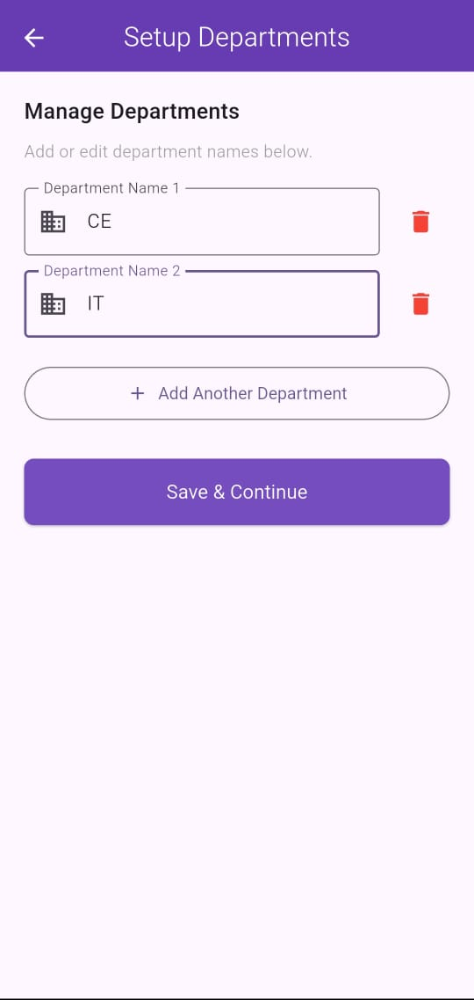 | 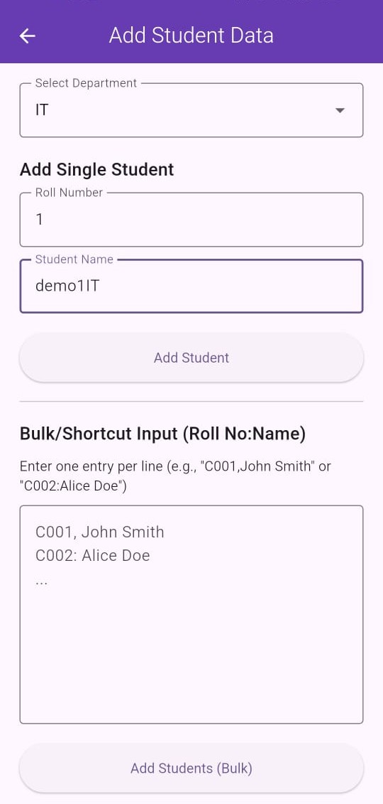 |
| *App Entry* | *Main Hub & Actions* | *Setup Depts* | *Manage Students* |

<br>

### **2. Scheduling & Attendance**
| **3. Time Table** | **4. Elective Setup** | **5. Take Attendance** | **6. Daily Report** |
|:---:|:---:|:---:|:---:|
| 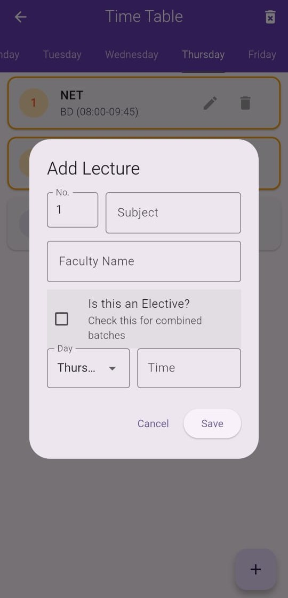 | 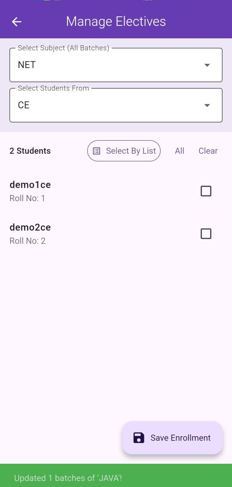 | 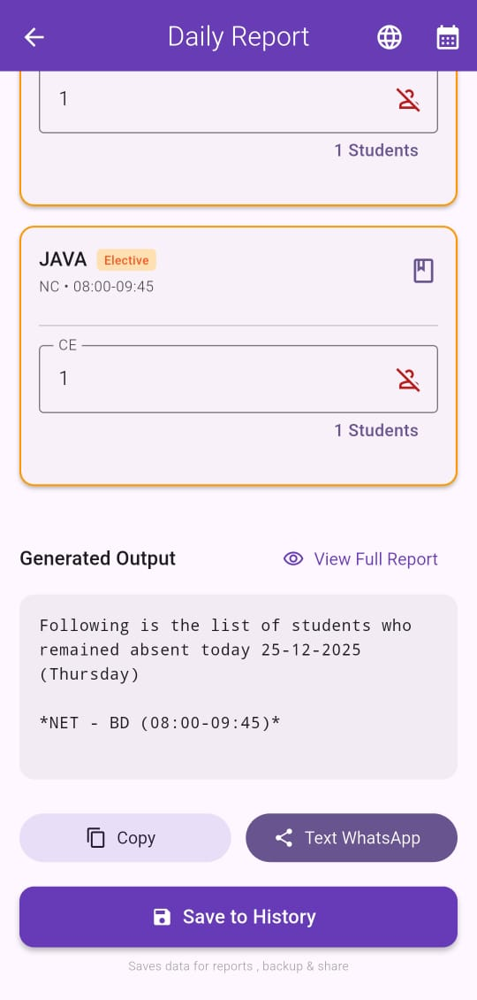 | 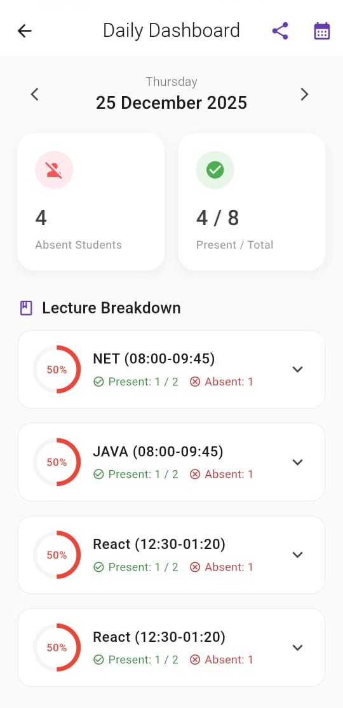 |
| *Weekly Schedule* | *Elective Batches* | *Mark Absent/Present* | *Daily Stats View* |

<br>

### **3. Insights & Reports**
| **7. Analytics** | **8. View Logs** | **9. Share / Output** | **10. HTML Report** |
|:---:|:---:|:---:|:---:|
| 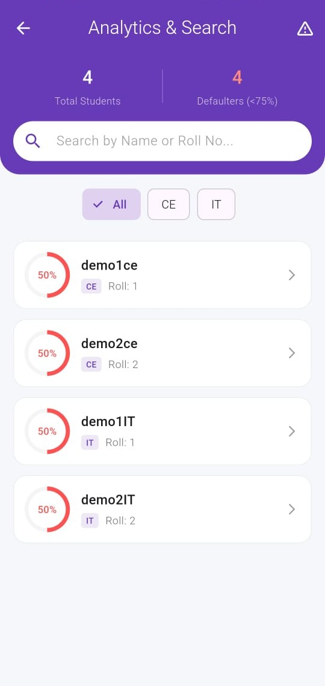 | 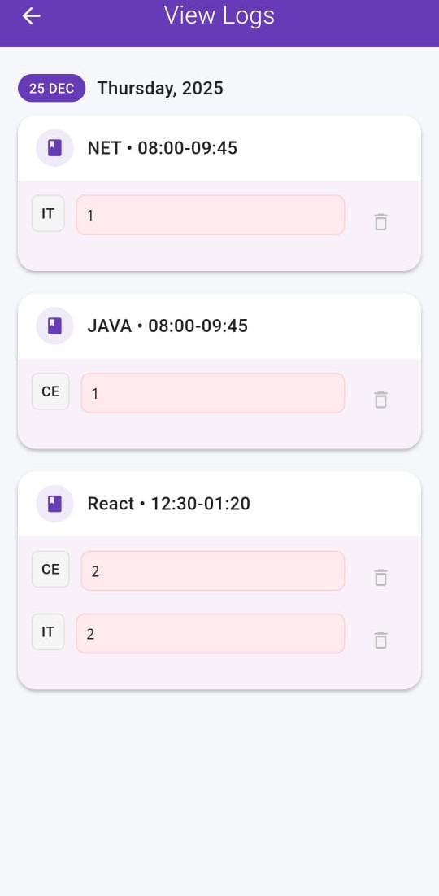 | 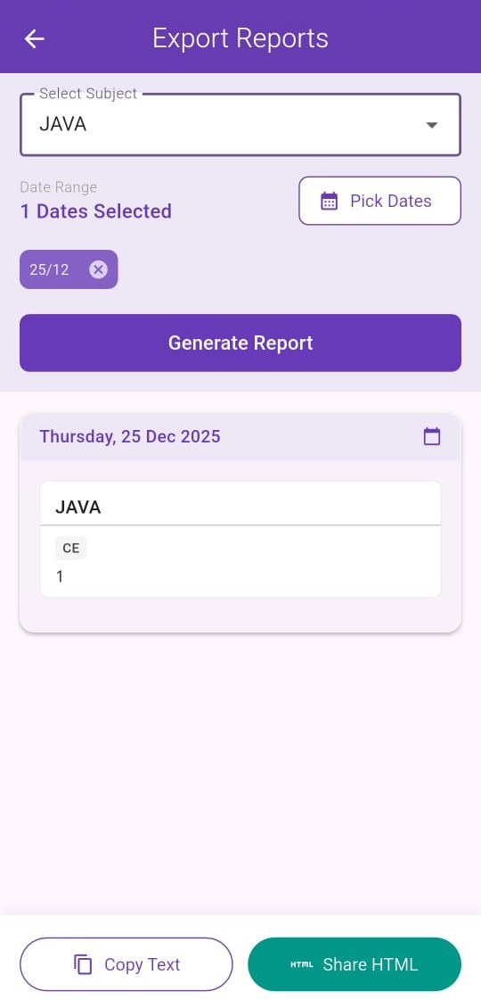 | 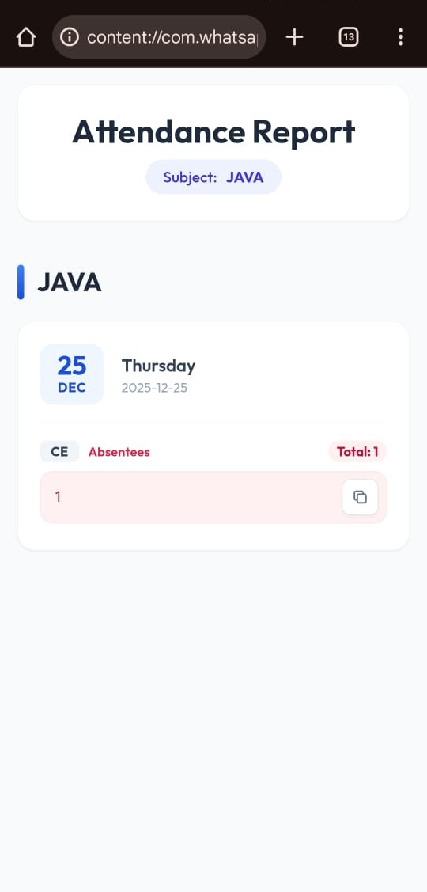 |
| *Defaulter Lists* | *Edit/Delete History* | *Auto-Message* | *Detailed Export* |

<br>

### **4. Data Safety**
| **11. Backup & Restore** | 
|:---:|
| 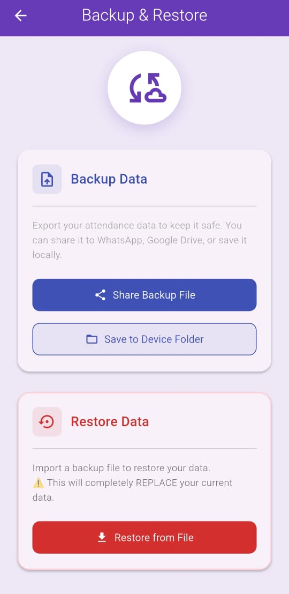 | 
| *Secure Data Backup* | 

---

## 📂 Project Structure & File Guide

Here is a quick map of the codebase to help developers understand the purpose of each file:

### **Core**
- **`main.dart`**: The entry point. Sets up the app theme, routes, and initializes the root widget.
- **`database/database_helper.dart`**: The "brain" of the app. Handles all SQLite operations (CRUD), table creation, and complex queries for reports.

### **Screens (UI)**
- **`splash_screen.dart`**: The animated startup screen with the app logo.
- **`home_screen.dart`**: The main dashboard containing the "Take Attendance" button, daily summary widgets, and navigation grid.
- **`report_generator_v3.dart`**: The core screen for taking attendance. It allows CRs to toggle absentees and generate the final message.
- **`daily_report_screen.dart`**: Displays a visual summary of the day's attendance (Present vs Absent charts).
- **`search_screen.dart`**: A powerful analytics dashboard. Allows searching for students, sorting by "Defaulters" (low attendance), and viewing class performance.
- **`student_detail_screen.dart`**: Shows a 360° view of a specific student, including their overall percentage, subject-wise breakdown, and dates absent.
- **`custom_report_screen.dart`**: Allows users to select a date range and export detailed reports as HTML or Text.
- **`time_table_screen.dart`**: Manages the weekly class schedule and defines which subjects are Electives.
- **`manage_enrollment_screen.dart`**: Handles mapping students to specific elective subjects.
- **`student_input_screen.dart`**: Provides forms to add students manually or via a bulk text import feature.
- **`department_setup_screen.dart`**: A setup screen to configure department names (e.g., CE, IT) before adding students.
- **`backup_screen.dart`**: Interface for exporting the database file (`.db`) or restoring from a backup.
- **`about_me_screen.dart`**: A portfolio page displaying developer information and contact links.

### **Models**
- **`student.dart`**, **`department.dart`**: Data models representing the database entities.
- **`student_report_models.dart`**: Helper models used to calculate and pass analytics data between screens.

---

## 🛠️ Tech Stack

- **Framework:** [Flutter](https://flutter.dev/) (Dart)
- **Database:** SQLite (`sqflite`) – For offline attendance logs
- **State Management:** Native (`setState`) & MVC Pattern
- **Key Packages:**
  - `flutter_native_splash` (Branding)
  - `share_plus` (Sharing Messages & Exports)
  - `path_provider` (File System Access)
  - `intl` (Date Formatting)
  - `file_picker` (Restoring Backups)

---

## 📲 Installation & Setup

1.  **Clone the Repo**

    ```bash
    git clone [https://github.com/yashmakwana03/absent_message.git](https://github.com/yashmakwana03/absent_message.git)
    ```

2.  **Install Dependencies**

    ```bash
    flutter pub get
    ```

3.  **Run the App**
    ```bash
    flutter run
    ```

---

## 👨‍💻 Developer

**Yash Makwana**

- 🎓 3rd Year Computer Science Student at RK University
- 💼 Class Representative (CR)
- 📧 [yashmakwana2275@gmail.com](mailto:yashmakwana2275@gmail.com)
- 🔗 [LinkedIn Profile](https://www.linkedin.com/in/yashmakwana03/)

> _This app is a result of my real-world responsibilities as a CR. What started as a simple website evolved into a full-fledged mobile app thanks to Flutter. I believe in creating tools that make life easier for students, faculty, and myself._

---

_⭐ If you find this project useful, please give it a star on GitHub!_
