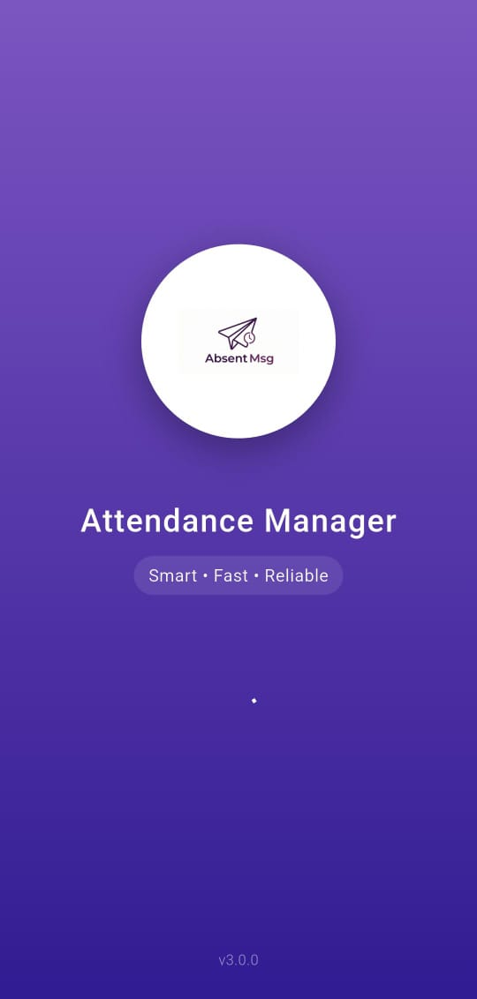
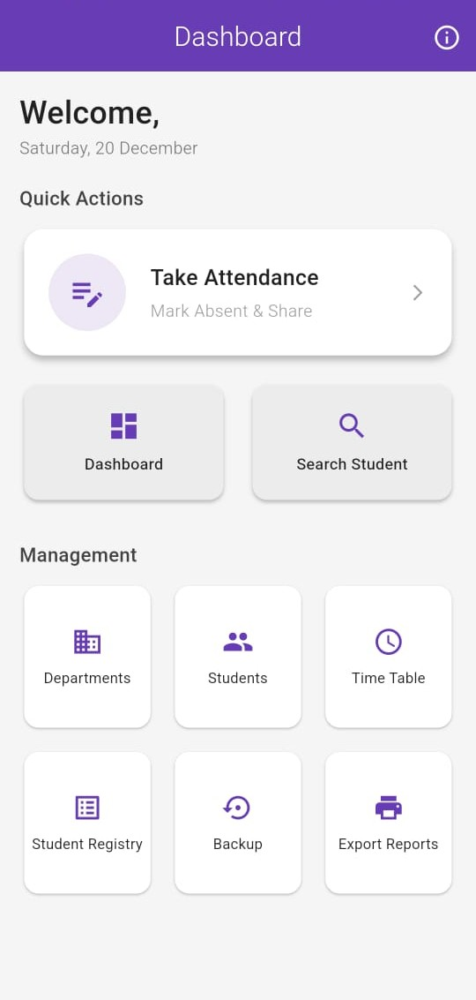
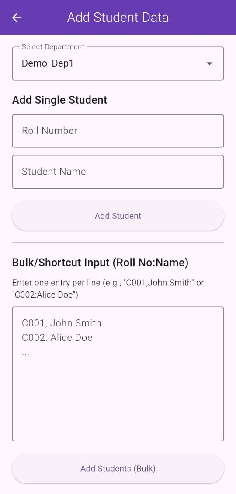
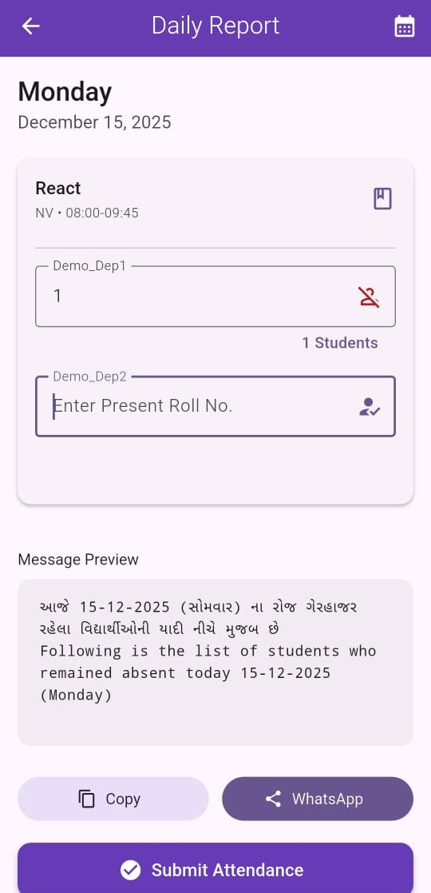
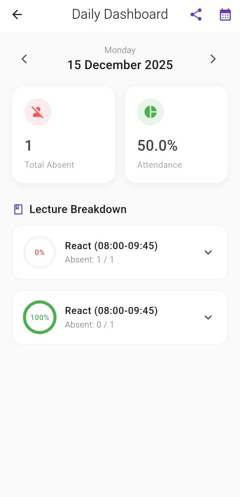
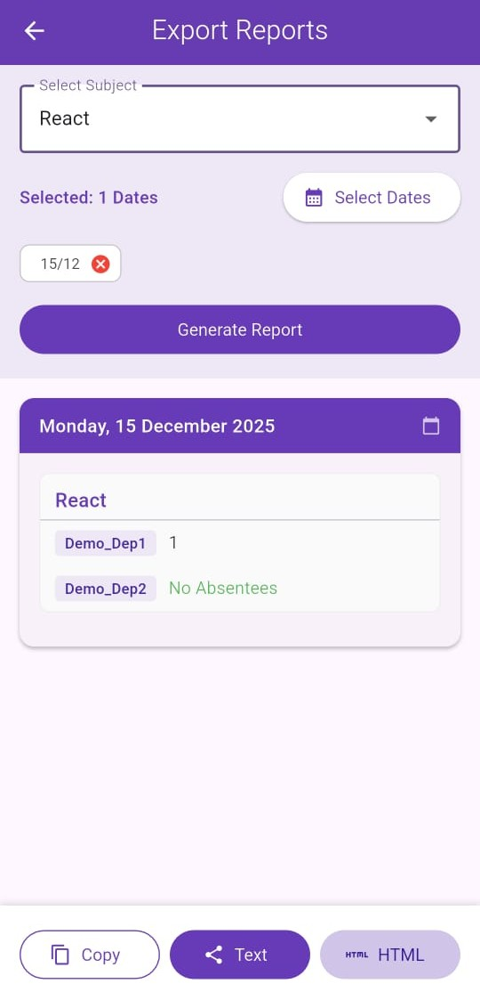
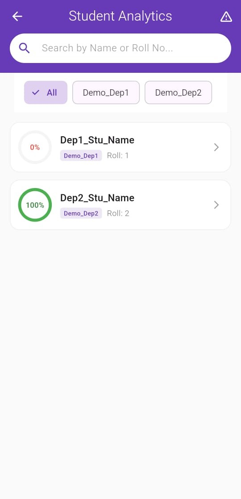
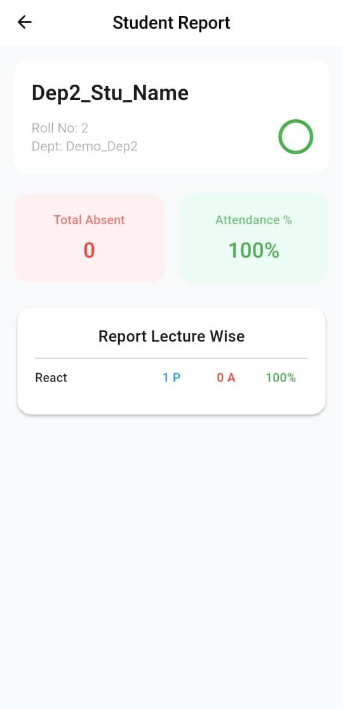
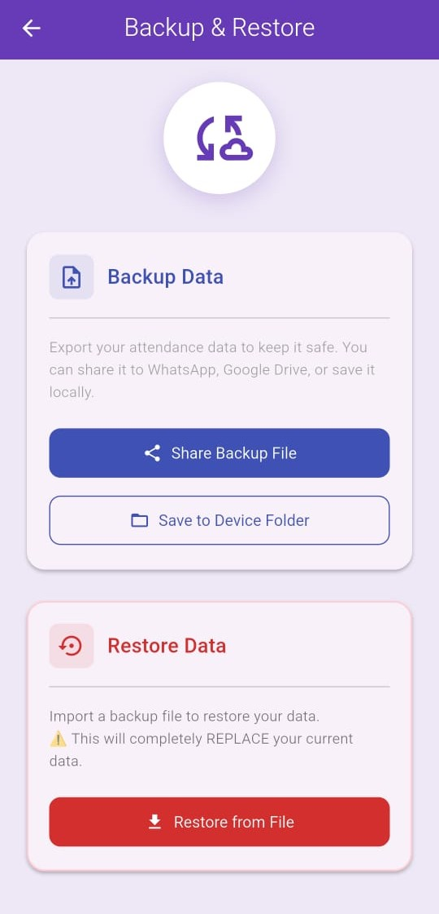

# 📱 Attendance Manager

<div align="center">
  <a href="https://github.com/yashmakwana03/attendance_manager/releases/latest">
    
  </a>
</div>
<br>

> **Smart. Fast. Reliable.**
> An offline-first mobile application designed to streamline the attendance process for Class Representatives (CRs) and faculty. Built with Flutter & SQLite.

---

## 🚀 Overview & My Journey

**Attendance Manager** is a project born out of necessity.

As the **Class Representative (CR)** at RK University for the past two years, I have been responsible for taking attendance and generating absent messages for parent groups. Initially, I solved this by building a simple website using inline CSS and JavaScript. While it worked, it had limitations: no offline storage and no easy way to save logs.

In my **5th semester**, I learned Flutter as part of my curriculum and saw the perfect opportunity to upgrade my workflow. I built this app to replace my old website, adding **SQLite for offline access**, faster entry methods, and automated message generation.

Now, when faculty ask for attendance reviews, I can instantly provide HTML files or text summaries directly from my phone. This project reflects my journey from basic web development to full-stack mobile engineering.

## ✨ Key Features

- **⚡ Quick Actions:** Mark attendance for a whole class in seconds.
- **📊 Dashboard:** Real-time view of daily stats and shortcuts.
- **🔍 Smart Search:** Instantly find student records by name or ID.
- **📂 Local Database:** Powered by **SQLite** for instant loading and 100% offline access – a major upgrade from my previous web tool.
- **🛡️ Data Safety:** Built-in **Backup & Restore** functionality (`.db` files).
- **🎓 Student Management:** Add, edit, or delete student profiles and organize them by department.
- **📈 Analytics:** View attendance percentages per student or per class.
- **💬 Message Generation:** Auto-generate formatted absent messages for WhatsApp groups.
- **📤 Export Options:** Generate HTML files for faculty to fill online registers or text summaries for daily reviews.

---

## 📸 App Tour

### **1. Getting Started**

|            **Splash Screen** |            **Home Dashboard** |             **Add Student** |
| :--------------------------------------: | :--------------------------------------: | :--------------------------------------: |
|  |  |  |
|     *Modern animated splash screen.* |     *Central hub with Quick Actions.* |  *Easily add students manually or in bulk.* |

<br>

### **2. Attendance Management**

|           **Take Attendance** |            **Daily Dashboard** |             **Export Reports** |
| :--------------------------------------: | :--------------------------------------: | :--------------------------------------: |
|  |  |  |
|      *Mark absent students quickly.* |      *View daily breakdown & stats.* |    *Generate reports for specific dates.* |

<br>

### **3. Student Analytics & Data**

|             **Student List** |            **Student Profile** |            **Backup & Restore** |
| :--------------------------------------: | :--------------------------------------: | :--------------------------------------: |
|  |  |  |
|      *Search and view class lists.* |  *Detailed individual attendance reports.* |      *Secure your data with one tap.* |

---

## 🛠️ Tech Stack

- **Framework:** [Flutter](https://flutter.dev/) (Dart)
- **Database:** SQLite (`sqflite`) – For offline attendance logs
- **State Management:** Native (`setState`) & MVC Pattern
- **Key Packages:**
  - `flutter_native_splash` (Branding)
  - `share_plus` (Sharing Messages & Exports)
  - `path_provider` (File System Access)
  - `intl` (Date Formatting)

---

## 📲 Installation & Setup

1.  **Clone the Repo**
    ```bash
    git clone [https://github.com/yashmakwana03/attendance_manager.git](https://github.com/yashmakwana03/attendance_manager.git)
    ```

2.  **Install Dependencies**
    ```bash
    flutter pub get
    ```

3.  **Run the App**
    ```bash
    flutter run
    ```

---

## 👨‍💻 Developer

**Yash Makwana**

- 🎓 3rd Year Computer Science Student at RK University
- 💼 Class Representative (CR)
- 📧 [yashmakwana2275@gmail.com](mailto:yashmakwana2275@gmail.com)
- 🔗 [LinkedIn Profile](https://www.linkedin.com/in/yashmakwana03/)

> *This app is a result of my real-world responsibilities as a CR. What started as a simple website evolved into a full-fledged mobile app thanks to Flutter. I believe in creating tools that make life easier for students, faculty, and myself.*

---

*⭐ If you find this project useful, please give it a star on GitHub!*
